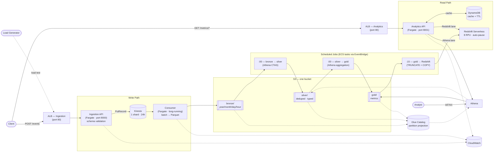

# Architecture

System design for the [Product Analytics Platform](../README.md).

## Event Model

```json
{
  "event_id":   "uuid",
  "event_type": "page_view | button_click | search | signup | purchase",
  "timestamp":  "2024-01-15T10:00:00Z",
  "user_id":    "...",
  "session_id": "...",
  "page":       "/products",
  "metadata":   {}
}
```

## Data Lake Layout

Medallion structure — one S3 bucket, three prefixes.

```
bronze/                         # raw — events as ingested, may contain duplicates
  year=YYYY/month=MM/day=DD/hour=HH/
    *.parquet

silver/                         # clean — deduped by event_id, typed timestamps
  year=YYYY/month=MM/day=DD/hour=HH/
    *.parquet

gold/                           # precomputed metrics — small, unpartitioned
  dau/ top_pages/ events/ conversion/ searches/
    *.parquet
```

Partitions are by **event-time** (the `timestamp` field), not arrival time. Each scheduled job reprocesses a bounded lookback window (~3 hours) to pick up late-arriving events without scanning all of history.

## AWS Services

| Service | Role |
|---|---|
| Amazon Kinesis (1 shard) | Event stream — durable buffer between ingest and persist |
| Amazon S3 | Data lake storage — bronze, silver, gold |
| Glue Data Catalog | Schema + partition projection for Athena (no crawler needed) |
| Amazon Athena | SQL engine — silver/gold jobs + ad-hoc queries |
| Redshift Serverless (8 RPU) | Low-latency serving when Athena cache-miss latency is insufficient |
| Amazon DynamoDB | Metric cache with TTL — shared by both serving lanes |
| ECS Fargate | Ingestion API, Analytics API, Consumer (long-running), scheduled job tasks |
| EventBridge (cron) | Triggers silver+gold jobs at :00, Redshift load at :15 each hour |
| ECR | Container images for all three services |
| ALB (×2) | Internet-facing — one for Ingestion API, one for Analytics API |
| CloudWatch Logs | Service logs, 2-week retention |
| IAM | Least-privilege task roles + GitHub Actions OIDC deploy role |

## System Flows

### 1. Ingestion

```
Client / Load Generator
  → ALB (port 80) → Ingestion API (Fargate, port 8000)
  → schema validation
  → Kinesis PutRecord (one call per event, partition key = session_id)
  → 202 Accepted  /  400 Rejected
```

One `PutRecord` per HTTP request — simple, sufficient for this scale. Batching via `PutRecords` is the natural upgrade path for higher throughput.

### 2. Processing (bronze)

```
Kinesis shard → Consumer (long-running Fargate)
  → read batch (GetRecords, limit 500)
  → buffer events in memory
  → flush when batch_max_size=2000 OR batch_max_interval=10s
  → write Parquet to s3://…/bronze/year=…/month=…/day=…/hour=…/
  → checkpoint sequence number to S3
```

Consumer holds one shard iterator. On crash, resumes from the last checkpoint — records are redelivered (at-least-once). Bronze may contain duplicates; that's accepted.

### 3. Refinement (silver) — hourly at :00

```
EventBridge cron → ECS RunTask (consumer image, CMD override)
  → Athena CTAS: bronze → silver
    - dedupe by event_id (keep latest)
    - cast timestamp string → timestamp type
    - drop rows that fail type coercion
    - overwrite target partition (idempotent)
  → covers last ~3 hours to catch late-arriving events
```

### 4. Aggregation (gold) — hourly at :00, after silver

```
EventBridge cron → ECS RunTask (consumer image, CMD override)
  → Athena INSERT OVERWRITE: silver → gold/<metric>/
    - DAU: distinct user_id per date
    - top pages: page view count ranked by views
    - event counts: count per event_type
    - conversion: sessions with signup that also have a later purchase / all signup sessions
    - top searches: search query count ranked
  → each metric is a small unpartitioned Parquet table
```

Conversion is session-scoped: `signup` → `purchase` within the same `session_id`, purchase timestamp after signup timestamp. One SQL pass over silver.

### 5. Serving — Athena lane (default)

```
Client → ALB (port 80) → Analytics API (Fargate, port 8001)
  → DynamoDB cache lookup (key = metric + params)
    → HIT:  return cached result (~1ms)
    → MISS: Athena query over gold S3 table (~1–2s)
            → write result to DynamoDB with TTL
            → return result
```

TTL: DAU and conversion = 5 min (change hourly), top pages / searches / events = 1 min. No mart tables required — gold Parquet is queried directly by Athena.

**Switch to Redshift lane when:** cache-miss latency must be <500ms, or concurrent users drive miss rate high enough that Athena becomes a bottleneck.

### 6. Serving — Redshift lane

```
Client → ALB (port 80) → Analytics API (Fargate, port 8001)
  → DynamoDB cache lookup
    → HIT:  return cached result (~1ms)
    → MISS: Redshift Data API query over mart tables (~50–200ms)
            → write result to DynamoDB with TTL
            → return result
```

Engine swap is one line in `analytics_api/main.py` — domain (`MetricsService`) and cache logic are unchanged. Requires mart tables to be populated (Flow 7).

### 7. Redshift load — hourly at :15

```
EventBridge cron → ECS RunTask (analytics-api image, CMD override)
  → jobs/redshift/load.py
  → for each metric: TRUNCATE mart table → COPY FROM s3://…/gold/<metric>/
  → one job per metric, idempotent
```

Runs 15 min after gold jobs complete. Only needed when Redshift lane is active. Mart data stays at previous snapshot if the job fails — stale but not missing.

### 8. Ad-hoc queries

```
Analyst → Athena (direct) → silver or bronze
```

Endpoints `GET /analytics/dau-trend` and `GET /analytics/hourly-events` are also available in the Analytics API for unbounded Athena scans directly over silver — accepts seconds latency, used for exploration and building new metrics.

## Component Diagram



> **Networking:** ALBs in public subnets (Internet Gateway); all Fargate tasks in private subnets (no public IPs). Egress via one NAT Gateway. Two AZs. Redshift Serverless and DynamoDB accessed from private subnets.

## Design Decisions

**Why a data lake, not a warehouse up front**

The workload is append-only immutable events — a natural fit for columnar object storage. Athena is pay-per-scan with no idle cost; a provisioned Redshift cluster bills by the hour even when idle. Redshift Serverless is added as a *serving* tier only, not for storage — it auto-pauses and costs nothing when the dashboard isn't being queried.

The lake also exposes the knobs (Parquet encoding, partition layout, batch size) that a managed warehouse hides — which is what the experiments measure.

**Why DynamoDB for cache, not ElastiCache**

ElastiCache has no Free Tier and bills per-hour for an always-on node. DynamoDB is in the Free Tier, has native TTL, and is emulated by Floci locally — no extra infra. ElastiCache is the right call at thousands of concurrent reads/sec; that doesn't apply here.

**Why Glue partition projection, not a crawler**

A crawler runs on a schedule and still misses new partitions written between runs. Partition projection makes new hours queryable the moment they're written, with zero cost and no crawler to manage.

## Failure & Recovery

| Stage | Failure | Recovery |
|---|---|---|
| Ingestion — invalid event | Schema validation fails | `400` synchronously; event never reaches Kinesis |
| Ingestion — Kinesis `PutRecord` fails | Throttle / transient | Retry with backoff; return `503` if still failing so client retries |
| Consumer crash before flush | Buffered events lost from memory | Kinesis retains 24h; consumer resumes from last S3 checkpoint on restart |
| Consumer partial write | Crash mid-Parquet write | Objects written to temp key then moved; partial temp object ignored on replay |
| Silver / gold job fails | Athena error / timeout | Jobs are idempotent (overwrite); EventBridge re-triggers next run; lookback window re-covers recent partitions |
| Analytics API — Athena query fails | Transient | Retry once, then `503`; reads are stateless |
| Redshift load job fails | COPY error | Idempotent (TRUNCATE + COPY); re-triggers next schedule; mart stays at previous snapshot |
| Analytics API — Redshift query fails | Transient / Data API timeout | Retry once, then `503`; cache hits unaffected |
| DynamoDB cache unavailable | Endpoint unreachable | Fall through to engine on every request; latency degrades, correctness unaffected |

**Principle:** Kinesis is the durable replay buffer. Every writer uses overwrite semantics. Recovery at any stage = replay from last checkpoint or re-run the job.

## Out of Scope

- Authentication / user management
- Machine learning
- Real-time push / notifications
- Provisioned Redshift (Serverless used instead)
- Multi-tenancy
