# Architecture

Detailed system design for the [Product Analytics Platform](../README.md).

## Requirements

### Functional

1. **Ingest & validate events** — Accept product events over an API, validate
   them against the event schema, and publish valid events to the stream
   (rejecting malformed ones).
2. **Persist as partitioned Parquet** — Consume streamed events, batch them, and
   write them to the Data Lake as Parquet, partitioned by `year/month/day/hour`.
3. **Serve analytics** — Expose the analytics endpoints (DAU, top pages, event
   counts, conversion, top searches) backed by SQL queries over the Data Lake.

### Non-Functional

1. **Scalability / throughput** — Sustain a high, configurable event rate
   (target 100k–1M events) with horizontally scalable ingestion and processing.
2. **Query efficiency / cost** — Minimize data scanned and query latency through
   Parquet + partitioning, keeping usage within AWS Free Tier / minimal cost.
3. **Observability & least privilege** — Emit logs and metrics for each stage
   (ingestion, processing, analytics) and enforce least-privilege IAM access.

## Core Features

### 1. Event Ingestion
- Receive product events
- Validate schema
- Publish events to a streaming platform

### 2. Event Processing
- Consume events
- Batch events
- Convert to Parquet
- Store in the partitioned **raw (bronze)** layer
- Produce a **silver (clean)** layer: dedupe by `event_id`, drop invalid rows,
  enforce types

### 3. Analytics
- Query historical data
- Expose analytics endpoints

### 4. Load Generator
- Simulate realistic user traffic
- Configurable event rates and concurrency

## Event Types

- `page_view`
- `button_click`
- `search`
- `signup`
- `purchase`

## Event Model

```json
{
  "event_id": "...",
  "event_type": "...",
  "timestamp": "...",
  "user_id": "...",
  "session_id": "...",
  "page": "...",
  "metadata": {}
}
```

## Data Lake Layout

The lake follows a lightweight **medallion** structure — a raw (bronze) layer of
events as-ingested, and a simple silver layer that is deduped, validated, and
typed. Scheduled Athena jobs roll silver up into **gold** (precomputed metrics)
served on-demand; ad-hoc Athena queries also run directly over silver/raw.

```
bronze/                       # raw — events as ingested (Parquet)
  year=YYYY/month=MM/day=DD/hour=HH/
    *.parquet
silver/                       # clean — deduped, validated, typed
  year=YYYY/month=MM/day=DD/hour=HH/
    *.parquet
gold/                         # precomputed metrics (small Parquet tables)
  <metric>/
    *.parquet
```

Partitions are by **event-time** (`year/month/day/hour` derived from each event's
`timestamp`), not arrival time — see the late-event note under System Flows.

### Partition Strategy

Both layers partition by:
- `year`
- `month`
- `day`
- `hour`

## Analytics Endpoints

| Endpoint                | Description                     |
| ----------------------- | ------------------------------- |
| `GET /metrics/dau`         | Daily Active Users              |
| `GET /metrics/top-pages`   | Most visited pages              |
| `GET /metrics/events`      | Event counts by type            |
| `GET /metrics/conversion`  | Signup → Purchase conversion (session funnel) |
| `GET /metrics/searches`    | Top search terms                |

## AWS Services

| Service                 | Purpose                              |
| ----------------------- | ------------------------------------ |
| Amazon Kinesis          | Event streaming                      |
| Amazon S3               | Data Lake storage                    |
| Glue Data Catalog       | Metadata catalog for Athena          |
| Amazon Athena           | SQL analytics over S3                |
| Amazon ECS / Fargate    | Run ingestion / processing services  |
| Redshift Serverless     | Low-latency serving tier (v2)        |
| Amazon DynamoDB         | Metric cache with TTL (v2)           |
| CloudWatch              | Logs and monitoring                  |
| IAM                     | Least privilege access               |

## System Flows

The platform is composed of the following end-to-end flows:

### 1. Ingestion Flow
Client / Load Generator → Ingestion API → schema validation → publish to stream.
Covers event intake, validation, and hand-off to the streaming platform.

### 2. Processing Flow
Stream → processing consumer → batch events → convert to Parquet → write
partitioned files to the **raw (bronze)** layer (`year/month/day/hour`).

> **At-least-once delivery:** Kinesis (and consumer retries / resharding) can
> deliver the same record more than once, so **bronze may contain duplicates**.
> This is accepted — **silver is the dedupe boundary** (dedupe by `event_id`).
> Nothing downstream of silver assumes bronze is unique.

### 3. Refinement Flow (Silver)
Raw (bronze) Parquet → dedupe by `event_id`, drop schema-invalid rows, enforce
types → write to the **clean (silver)** layer with the same partitioning. This
is the layer analytics read from.

> **Idempotent per partition (overwrite, never append):** the job **replaces**
> the target partition's contents each run — write to a fresh path / drop the
> partition's objects then `CREATE TABLE AS`, rather than blind `INSERT INTO`
> (which appends and would double rows on any re-run). Re-running a partition is
> therefore safe and produces identical output.
>
> **Late / out-of-order events:** because partitions are by **event-time**, a
> late-arriving event lands in an already-written past hour (Parquet is
> immutable → a *new* file in that old partition). To pick it up without
> reprocessing all of history, each scheduled run **reprocesses a bounded
> lookback window** (e.g. the last ~3 hours), not just the newest hour. Events
> later than the window are dropped and logged. (This is the pragmatic,
> no-watermark version of allowed-lateness used by Flink / Spark / Dataflow.)

### 4. Cataloging Flow
New Parquet partitions → Glue Data Catalog (schema + partitions) → queryable by
Athena. Keeps table metadata and partitions in sync with S3.

### 5. Aggregation Flow (Gold, scheduled)
Scheduled (hourly/daily) Athena queries roll the **silver** layer up into
**gold** — precomputed metrics (DAU, top pages, event counts, conversion, top
searches) — written back to S3 as small Parquet tables. This is the "daily
compute" path: heavy scans happen on a schedule, not per request. Like silver,
gold jobs **overwrite the target partition/table** each run (idempotent), never
append.

> **Conversion metric:** session-scoped funnel — of the sessions that contain a
> `signup`, the fraction that also contain a `purchase` occurring **after** the
> signup within the **same `session_id`**. Matches how Amplitude / Mixpanel /
> GA4 report funnel conversion, and is one SQL pass over silver.

### 6. On-Demand Analytics Flow (serving)

Two lanes exist in the codebase. The serving API swaps the engine adapter in
`main.py`; the domain (`MetricsService`) and cache logic are unchanged in both.

**Athena lane** — current default.
Client → Serving API → DynamoDB cache lookup → cache hit: return (~1ms).
Cache miss: narrow Athena query over gold S3 tables (~1–2s) → write to
DynamoDB with TTL → return. Right for: endpoints queried a few times per day,
1–2s on cache miss is acceptable, no persistent mart tables needed.

**Redshift lane** — activate when Athena lane is insufficient.
Client → Serving API → DynamoDB cache lookup → cache hit: return (~1ms).
Cache miss: Redshift Data API query over mart tables (~50–200ms) → write to
DynamoDB with TTL → return. Requires `load_redshift.py` to keep marts in sync
after each gold job.

**When to switch lanes:**
- Cache miss latency must be <500ms (e.g. user-triggered drilldowns)
- Concurrent users drive cache miss rate high enough that Athena becomes a bottleneck
- Queries join across multiple large gold tables (Redshift handles this cheaper than Athena per-scan)

The DynamoDB cache is shared by both lanes — TTL values and cache keys are identical.

### 7. Ad-hoc Query Flow
Analyst / exploration → Athena directly over silver (or raw) for one-off,
unbounded SQL. Accepts seconds-latency and per-query scan cost in exchange for
full flexibility — used for investigation and to build new gold metrics.

### 8. Load Testing / Experiment Flow
Load Generator drives traffic through the ingestion flow while metrics are
captured (throughput, latency, data scanned) to run the partitioning and
batch-size experiments.

### 9. Redshift Load Flow (v2)
After each gold job completes, a loader job (`jobs/load_redshift.py`) runs
TRUNCATE + COPY from `s3://analytics-lake/gold/<metric>/` into the matching
Redshift Serverless mart table. One job per metric, idempotent — safe to re-run.
EventBridge chains the trigger: gold job completion → load job start.

## Architecture

### Why a Data Lake (not a Warehouse)

- **Workload is append-only events, not relational state.** High-volume,
  immutable, semi-structured (the `metadata` JSON) — a natural fit for
  schema-on-read object storage in open formats, not modeled warehouse tables.
- **Cost / Free Tier.** S3 + Athena is pay-per-GB-stored and pay-per-query; a
  provisioned Redshift cluster bills by the hour even idle. This is why
  provisioned Redshift is out of scope — v2 uses **Redshift Serverless**, which
  bills only for compute time during active queries (pay-per-RPU-second), keeping
  cost near zero under infrequent load.
- **The experiments are the point.** Success is measured by improvements from
  Parquet, partitioning, and batching — file-format and layout knobs a warehouse
  hides behind its managed engine. The lake exposes exactly what we want to test.
- **Schema-on-read fits an evolving event model.** New event types / metadata
  fields need a catalog update, not a warehouse DDL migration.
- **Decoupled storage & compute.** S3 is the durable source of truth; any engine
  (Athena today, others later) can read it.

**Tradeoff accepted:** no enforced schema/constraints, weaker transactional
guarantees — fine here. Sub-second BI latency is addressed in v2 via Redshift
Serverless marts + DynamoDB cache.

### Query Paths

Three deliberately separate paths so serving latency is decoupled from scan cost:

| Path | Engine | Reads | Latency | When |
| ---- | ------ | ----- | ------- | ---- |
| On-demand serving — Athena lane | Serving API → DynamoDB cache → Athena | DynamoDB / gold S3 | ~1ms / ~1–2s | Default; few requests/day, miss latency acceptable |
| On-demand serving — Redshift lane | Serving API → DynamoDB cache → Redshift | DynamoDB / Redshift mart | ~1ms / ~50–200ms | High concurrency, sub-500ms miss latency required |
| Scheduled aggregation | Athena CTAS/INSERT | silver → gold | seconds (batch) | Hourly/daily metric rollups |
| Redshift load | TRUNCATE + COPY | gold S3 → Redshift mart | seconds (batch) | After each gold job; only needed when Redshift lane is active |
| Ad-hoc / exploration | Athena | silver / bronze | seconds | One-off investigation, new metrics |

> **v2 cache strategy:** DynamoDB TTL per metric — DAU: 5 min (changes hourly),
> top pages / searches / events: 1 min (higher read variability), conversion:
> 5 min. Cache key = metric name + query params. On miss: Redshift Data API
> query → write to DynamoDB → return. No persistent connection needed.
>
> **Why DynamoDB over ElastiCache:** ElastiCache has no Free Tier and bills
> per-hour for an always-on cluster. DynamoDB offers 25 GB + 25 RCU/WCU on Free
> Tier, native TTL, and is already emulated by Floci locally — zero extra infra
> or code-path changes. ElastiCache is the right call at thousands of concurrent
> reads/sec or for shared session state; neither applies here.

### Component Diagram (v1)


> **Networking (not drawn, kept out of the diagram for clarity):** the ALB sits
> in a **public subnet** reached via an **Internet Gateway**; all Fargate
> services run in a **private subnet** with no public IPs. Egress to
> S3/Kinesis/Athena/Glue goes through **VPC endpoints** (S3 gateway + interface
> endpoints) — **no NAT Gateway**, keeping traffic on the AWS network and off the
> Free-Tier cost sheet. Single AZ for v1 simplicity.

**Notes**
- **One internet-facing ALB** is the single system entrypoint; it path-routes
  `POST /events` to the Ingestion API and `GET /metrics/*` to the Serving API.
  API Gateway is intentionally skipped — at this project's scale (no auth, heavy
  load-testing) its per-request pricing loses to the ALB's flat hourly cost, and
  an ALB is needed anyway to front Fargate tasks. (Network layout — subnets,
  Internet Gateway, VPC endpoints — is in the note above the diagram.)
- **One S3 bucket** holds the lake; `bronze/`, `silver/`, `gold/` are top-level
  **prefixes**, not separate buckets.
- **EventBridge** = serverless cron; it triggers the scheduled Athena silver/gold
  jobs.
- **Ingestion API** and **Serving API** are separate Fargate services (independent
  scaling, blast-radius isolation, distinct least-privilege IAM).
- **Consumer** is a long-running Fargate service that buffers events and flushes
  **new** Parquet objects per partition (Parquet is immutable — never updated in
  place). Batch size/flush interval feed the batching experiment.
- **Silver & gold** are built by **scheduled Athena SQL** (idempotent per
  partition), not Spark.
- **Glue Catalog uses partition projection** — no crawler, no `ADD PARTITION`;
  new hours are queryable the moment they're written.

### Component Diagram (v2)

```mermaid
flowchart LR
    Client([Client])
    LoadGen([Load Generator])
    Analyst([Analyst])
    Dashboard([Dashboard])

    ALB["Internet-facing ALB<br/>(single entrypoint)<br/>path routing"]

    subgraph Ingest["Write Path"]
        IngAPI["Ingestion API<br/>(Fargate / FastAPI)<br/>schema validation"]
        Kinesis[(Amazon Kinesis)]
        Consumer["Consumer<br/>(long-running Fargate)<br/>batch → Parquet"]
    end

    subgraph Serve["Read Path"]
        SrvAPI["Serving API<br/>(Fargate / FastAPI)"]
        DDB[("DynamoDB<br/>metric cache + TTL")]
        RS["Redshift Serverless<br/>mart tables"]
    end

    subgraph Lake["S3 Data Lake — one bucket, three prefixes"]
        Bronze[["bronze/<br/>year/month/day/hour"]]
        Silver[["silver/<br/>deduped · typed"]]
        Gold[["gold/<br/>precomputed metrics"]]
    end

    subgraph Refine["Scheduled Jobs"]
        EB1{{"EventBridge<br/>(cron)"}}
        SilverJob["Athena CTAS/INSERT<br/>bronze → silver"]
        EB2{{"EventBridge<br/>(cron)"}}
        GoldJob["Athena aggregation<br/>silver → gold"]
        EB3{{"EventBridge<br/>(chained)"}}
        LoadJob["Redshift loader<br/>TRUNCATE + COPY<br/>gold → mart"]
    end

    Catalog[("Glue Data Catalog<br/>partition projection")]
    Athena[Amazon Athena]
    CW[(CloudWatch)]

    %% entrypoint + routing
    Client -->|"POST /events"| ALB
    Client -->|"GET /metrics/*"| ALB
    Dashboard -->|"GET /metrics/*"| ALB
    LoadGen -.->|load test| ALB
    ALB -->|/events| IngAPI
    ALB -->|/metrics| SrvAPI

    %% write path
    IngAPI -->|PutRecord| Kinesis --> Consumer --> Bronze

    %% refine + aggregate
    EB1 --> SilverJob
    Bronze --> SilverJob --> Silver
    EB2 --> GoldJob
    Silver --> GoldJob --> Gold

    %% redshift load
    EB3 --> LoadJob
    Gold --> LoadJob --> RS

    %% serving — cache-aside
    SrvAPI -->|cache lookup| DDB
    DDB -.->|miss| SrvAPI
    SrvAPI -->|Data API query| RS
    RS -.->|result| SrvAPI
    SrvAPI -->|cache write + TTL| DDB

    %% catalog + ad-hoc
    Catalog -.->|schema + partitions| Athena
    Bronze -.-> Catalog
    Silver -.-> Catalog
    Gold -.-> Catalog
    Analyst -->|ad-hoc SQL| Athena
    Athena -.-> Silver

    %% observability
    IngAPI -.-> CW
    Consumer -.-> CW
    SrvAPI -.-> CW
```



> **Networking (v2, same as v1 plus):** Redshift Serverless namespace sits in
> the same private subnet as the Fargate services; the Serving API reaches it via
> the Data API endpoint (no persistent driver connection). DynamoDB is accessed
> via a VPC endpoint — no NAT Gateway required.

**v2 notes**
- **Two serving lanes** — Athena lane is the default (no mart tables required);
  Redshift lane activates when cache miss latency must be <500ms or concurrency
  is high. Engine swap is one line in `main.py`; domain is unchanged.
- **Redshift Serverless** is the Redshift lane engine. Mart tables are small
  (one row per DAU date / top-N page / etc.) — queries are microsecond column
  lookups, not scans. Kept in sync by `load_redshift.py` (TRUNCATE + COPY after
  each gold job) — only needed when the Redshift lane is active.
- **DynamoDB cache** sits in front of both lanes. Cache key = metric name +
  serialized query params. TTL per metric: DAU and conversion = 5 min
  (hourly cadence), top pages / searches / events = 1 min. Hit rate expected
  >95% under normal dashboard load.
- **Hexagonal adapter swap** — `MetricsService` domain is unchanged. `main.py`
  wires `AthenaEngine` or `RedshiftEngine` + `DynamoDBCache`; `DuckDBEngine` +
  local DynamoDB locally.
- **Dashboard** is a static HTML + Chart.js page served by `FastAPI StaticFiles`
  locally, S3 + CloudFront in production.

### Failure & Recovery

Each stage has a defined behavior on failure so no accepted event is silently
lost:

| Stage | Failure | Handling / recovery |
| ----- | ------- | ------------------- |
| **Ingestion — invalid event** | Fails schema validation | Reject synchronously with `400`; increment a `rejected_events` metric and log the reason. Never published to the stream. |
| **Ingestion — valid event, Kinesis `PutRecord` fails** | Throttling / transient error | Retry with backoff; on partial-batch failure, retry only the failed records. If still failing, return `503` so the client/load-gen retries (event not yet acknowledged). |
| **Consumer crash before flush** | Buffered events lost from memory | Kinesis **retains records (24h default)**; on restart the consumer resumes from its last **checkpoint** and re-reads. Un-acked records are redelivered → at-least-once (bronze dupes, removed at silver). |
| **Consumer flush partially written** | Crash mid-write to bronze | Parquet objects are written **new per flush** (never in place) to a temp key, then atomically moved; a partial temp object is ignored and reprocessed on replay. |
| **Silver / gold scheduled job fails** | Athena query error / timeout | Job is **idempotent per partition** (overwrite, not append), so EventBridge/the runner simply **re-runs** it; a rerun fully rebuilds the affected partitions. The bounded lookback window also re-covers recent partitions on the next scheduled run. |
| **Serving API — Athena query fails** | Transient / throttling | Retry once, then `503`; reads are stateless and side-effect-free, safe to retry. |
| **Redshift load job fails** (v2) | COPY error / timeout | Job is idempotent (TRUNCATE + COPY each run); EventBridge re-triggers on next schedule. Mart data stays at previous snapshot — stale but not missing. |
| **Serving API — Redshift query fails** (v2) | Transient / Data API timeout | Retry once, then `503`. Cache miss path only — cache hits are unaffected. |
| **DynamoDB cache unavailable** (v2) | Endpoint unreachable | Fall through to Redshift on every request; latency degrades to ~200ms but correctness is unaffected. Cache is a performance layer, not a source of truth. |

**Principle:** the stream is the durable buffer between accept and persist
(replayable within retention), and every batch/aggregation writer is
replaceable-on-rerun (overwrite semantics), so recovery is "replay from the last
checkpoint / re-run the job" at every stage — no manual repair.

## Success Criteria

- ✅ Ingest **100k–1M events** end-to-end without data loss (verified: 1M events, 0 failures)
- ✅ All events land as partitioned Parquet in bronze; silver is deduplicated and typed
- ✅ Analytics endpoints return correct results backed by gold queries (DAU, events, conversion, top pages, searches verified)
- ✅ **Parquet compression:** 1.6× size reduction vs raw JSON at 295k events (improves with scale)
- ✅ **Batch size:** 559 files for 295k events at `BATCH_MAX_SIZE=500` (~527 events/file)
- ✅ **Partitioning:** partition pruning reduces data scanned proportionally to partition selectivity (most effective at week/month scale)
- ✅ **Throughput:** 588 rps sustained at concurrency=50 (bottleneck: ingestion API; scales horizontally with multiple Fargate tasks on real AWS)
- **Batch-size experiment:** measurable throughput / file-count tradeoff with numbers recorded
- Load generator sustains target rate without the pipeline falling behind

## Out of Scope

**v1 & v2:**
- Authentication
- User management
- Machine Learning
- Real-time notifications
- Provisioned Redshift cluster (Serverless used instead)
