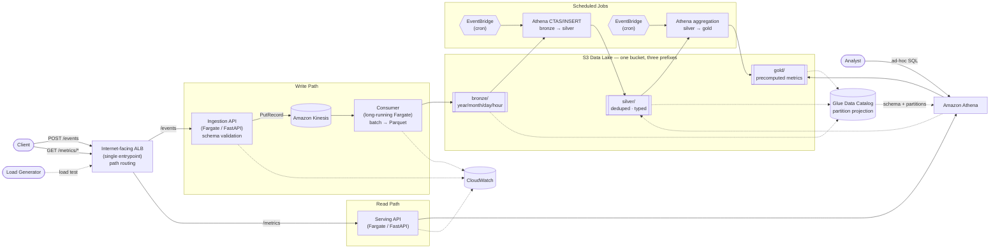

# Architecture

Detailed system design for the [Product Analytics Platform](../README.md).

## Requirements

### Functional

1. **Ingest & validate events** — Accept product events over an API, validate
   them against the event schema, and publish valid events to the stream
   (rejecting malformed ones).
2. **Persist as partitioned Parquet** — Consume streamed events, batch them, and
   write them to the Data Lake as Parquet, partitioned by `year/month/day/hour`.
3. **Serve analytics** — Expose the analytics endpoints (DAU, top pages, event
   counts, conversion, top searches) backed by SQL queries over the Data Lake.

### Non-Functional

1. **Scalability / throughput** — Sustain a high, configurable event rate
   (target 100k–1M events) with horizontally scalable ingestion and processing.
2. **Query efficiency / cost** — Minimize data scanned and query latency through
   Parquet + partitioning, keeping usage within AWS Free Tier / minimal cost.
3. **Observability & least privilege** — Emit logs and metrics for each stage
   (ingestion, processing, analytics) and enforce least-privilege IAM access.

## Core Features

### 1. Event Ingestion
- Receive product events
- Validate schema
- Publish events to a streaming platform

### 2. Event Processing
- Consume events
- Batch events
- Convert to Parquet
- Store in the partitioned **raw (bronze)** layer
- Produce a **silver (clean)** layer: dedupe by `event_id`, drop invalid rows,
  enforce types

### 3. Analytics
- Query historical data
- Expose analytics endpoints

### 4. Load Generator
- Simulate realistic user traffic
- Configurable event rates and concurrency

## Event Types

- `page_view`
- `button_click`
- `search`
- `signup`
- `purchase`

## Event Model

```json
{
  "event_id": "...",
  "event_type": "...",
  "timestamp": "...",
  "user_id": "...",
  "session_id": "...",
  "page": "...",
  "metadata": {}
}
```

## Data Lake Layout

The lake follows a lightweight **medallion** structure — a raw (bronze) layer of
events as-ingested, and a simple silver layer that is deduped, validated, and
typed. Scheduled Athena jobs roll silver up into **gold** (precomputed metrics)
served on-demand; ad-hoc Athena queries also run directly over silver/raw.

```
bronze/                       # raw — events as ingested (Parquet)
  year=YYYY/month=MM/day=DD/hour=HH/
    *.parquet
silver/                       # clean — deduped, validated, typed
  year=YYYY/month=MM/day=DD/hour=HH/
    *.parquet
gold/                         # precomputed metrics (small Parquet tables)
  <metric>/
    *.parquet
```

Partitions are by **event-time** (`year/month/day/hour` derived from each event's
`timestamp`), not arrival time — see the late-event note under System Flows.

### Partition Strategy

Both layers partition by:
- `year`
- `month`
- `day`
- `hour`

## Analytics Endpoints

| Endpoint                | Description                     |
| ----------------------- | ------------------------------- |
| `GET /metrics/dau`         | Daily Active Users              |
| `GET /metrics/top-pages`   | Most visited pages              |
| `GET /metrics/events`      | Event counts by type            |
| `GET /metrics/conversion`  | Signup → Purchase conversion (session funnel) |
| `GET /metrics/searches`    | Top search terms                |

## AWS Services

| Service                 | Purpose                              |
| ----------------------- | ------------------------------------ |
| Amazon Kinesis          | Event streaming                      |
| Amazon S3               | Data Lake storage                    |
| Glue Data Catalog       | Metadata catalog for Athena          |
| Amazon Athena           | SQL analytics over S3                |
| Amazon ECS / Fargate    | Run ingestion / processing services  |
| CloudWatch              | Logs and monitoring                  |
| IAM                     | Least privilege access               |

## System Flows

The platform is composed of the following end-to-end flows:

### 1. Ingestion Flow
Client / Load Generator → Ingestion API → schema validation → publish to stream.
Covers event intake, validation, and hand-off to the streaming platform.

### 2. Processing Flow
Stream → processing consumer → batch events → convert to Parquet → write
partitioned files to the **raw (bronze)** layer (`year/month/day/hour`).

> **At-least-once delivery:** Kinesis (and consumer retries / resharding) can
> deliver the same record more than once, so **bronze may contain duplicates**.
> This is accepted — **silver is the dedupe boundary** (dedupe by `event_id`).
> Nothing downstream of silver assumes bronze is unique.

### 3. Refinement Flow (Silver)
Raw (bronze) Parquet → dedupe by `event_id`, drop schema-invalid rows, enforce
types → write to the **clean (silver)** layer with the same partitioning. This
is the layer analytics read from.

> **Idempotent per partition (overwrite, never append):** the job **replaces**
> the target partition's contents each run — write to a fresh path / drop the
> partition's objects then `CREATE TABLE AS`, rather than blind `INSERT INTO`
> (which appends and would double rows on any re-run). Re-running a partition is
> therefore safe and produces identical output.
>
> **Late / out-of-order events:** because partitions are by **event-time**, a
> late-arriving event lands in an already-written past hour (Parquet is
> immutable → a *new* file in that old partition). To pick it up without
> reprocessing all of history, each scheduled run **reprocesses a bounded
> lookback window** (e.g. the last ~3 hours), not just the newest hour. Events
> later than the window are dropped and logged. (This is the pragmatic,
> no-watermark version of allowed-lateness used by Flink / Spark / Dataflow.)

### 4. Cataloging Flow
New Parquet partitions → Glue Data Catalog (schema + partitions) → queryable by
Athena. Keeps table metadata and partitions in sync with S3.

### 5. Aggregation Flow (Gold, scheduled)
Scheduled (hourly/daily) Athena queries roll the **silver** layer up into
**gold** — precomputed metrics (DAU, top pages, event counts, conversion, top
searches) — written back to S3 as small Parquet tables. This is the "daily
compute" path: heavy scans happen on a schedule, not per request. Like silver,
gold jobs **overwrite the target partition/table** each run (idempotent), never
append.

> **Conversion metric:** session-scoped funnel — of the sessions that contain a
> `signup`, the fraction that also contain a `purchase` occurring **after** the
> signup within the **same `session_id`**. Matches how Amplitude / Mixpanel /
> GA4 report funnel conversion, and is one SQL pass over silver.

### 6. On-Demand Analytics Flow (serving)
Client → **Serving API** → narrow, cheap Athena query over the small **gold**
tables → JSON response (~1–2s, tiny scan). This is the user-facing query path —
no full-scan per request. _(v2 fronts this with a low-latency serving store /
Redshift for millisecond reads.)_

### 7. Ad-hoc Query Flow
Analyst / exploration → Athena directly over silver (or raw) for one-off,
unbounded SQL. Accepts seconds-latency and per-query scan cost in exchange for
full flexibility — used for investigation and to build new gold metrics.

### 8. Load Testing / Experiment Flow
Load Generator drives traffic through the ingestion flow while metrics are
captured (throughput, latency, data scanned) to run the partitioning and
batch-size experiments.

## Architecture

### Why a Data Lake (not a Warehouse)

- **Workload is append-only events, not relational state.** High-volume,
  immutable, semi-structured (the `metadata` JSON) — a natural fit for
  schema-on-read object storage in open formats, not modeled warehouse tables.
- **Cost / Free Tier.** S3 + Athena is pay-per-GB-stored and pay-per-query; a
  warehouse (Redshift) means an always-on provisioned cluster billing by the
  hour. This is why Redshift is explicitly out of scope.
- **The experiments are the point.** Success is measured by improvements from
  Parquet, partitioning, and batching — file-format and layout knobs a warehouse
  hides behind its managed engine. The lake exposes exactly what we want to test.
- **Schema-on-read fits an evolving event model.** New event types / metadata
  fields need a catalog update, not a warehouse DDL migration.
- **Decoupled storage & compute.** S3 is the durable source of truth; any engine
  (Athena today, others later) can read it.

**Tradeoff accepted:** no enforced schema/constraints, no sub-second BI latency,
weaker transactional guarantees — all fine here (no dashboards, historical/batch
analytics, seconds-latency ad-hoc queries are acceptable).

### Query Paths

Two deliberately separate paths so serving latency is decoupled from scan cost:

| Path | Engine | Reads | Latency | When |
| ---- | ------ | ----- | ------- | ---- |
| On-demand serving | Serving API → narrow Athena query | small gold table | ~1–2s, tiny scan | User-facing analytics endpoints |
| Scheduled aggregation | Athena CTAS/INSERT | silver → gold | seconds (batch) | Hourly/daily metric rollups |
| Ad-hoc / exploration | Athena | silver / bronze | seconds | One-off investigation, new metrics |

> **v1 note:** gold lives as small Parquet tables in S3; the Serving API runs a
> narrow, cheap Athena query over them. The low-latency serving store
> (DynamoDB/Redis) and Redshift marts are **v2**.

### Component Diagram (v1)



> **Networking (not drawn, kept out of the diagram for clarity):** the ALB sits
> in a **public subnet** reached via an **Internet Gateway**; all Fargate
> services run in a **private subnet** with no public IPs. Egress to
> S3/Kinesis/Athena/Glue goes through **VPC endpoints** (S3 gateway + interface
> endpoints) — **no NAT Gateway**, keeping traffic on the AWS network and off the
> Free-Tier cost sheet. Single AZ for v1 simplicity.

**Notes**
- **One internet-facing ALB** is the single system entrypoint; it path-routes
  `POST /events` to the Ingestion API and `GET /metrics/*` to the Serving API.
  API Gateway is intentionally skipped — at this project's scale (no auth, heavy
  load-testing) its per-request pricing loses to the ALB's flat hourly cost, and
  an ALB is needed anyway to front Fargate tasks. (Network layout — subnets,
  Internet Gateway, VPC endpoints — is in the note above the diagram.)
- **One S3 bucket** holds the lake; `bronze/`, `silver/`, `gold/` are top-level
  **prefixes**, not separate buckets.
- **EventBridge** = serverless cron; it triggers the scheduled Athena silver/gold
  jobs.
- **Ingestion API** and **Serving API** are separate Fargate services (independent
  scaling, blast-radius isolation, distinct least-privilege IAM).
- **Consumer** is a long-running Fargate service that buffers events and flushes
  **new** Parquet objects per partition (Parquet is immutable — never updated in
  place). Batch size/flush interval feed the batching experiment.
- **Silver & gold** are built by **scheduled Athena SQL** (idempotent per
  partition), not Spark.
- **Glue Catalog uses partition projection** — no crawler, no `ADD PARTITION`;
  new hours are queryable the moment they're written.

### Failure & Recovery

Each stage has a defined behavior on failure so no accepted event is silently
lost:

| Stage | Failure | Handling / recovery |
| ----- | ------- | ------------------- |
| **Ingestion — invalid event** | Fails schema validation | Reject synchronously with `400`; increment a `rejected_events` metric and log the reason. Never published to the stream. |
| **Ingestion — valid event, Kinesis `PutRecord` fails** | Throttling / transient error | Retry with backoff; on partial-batch failure, retry only the failed records. If still failing, return `503` so the client/load-gen retries (event not yet acknowledged). |
| **Consumer crash before flush** | Buffered events lost from memory | Kinesis **retains records (24h default)**; on restart the consumer resumes from its last **checkpoint** and re-reads. Un-acked records are redelivered → at-least-once (bronze dupes, removed at silver). |
| **Consumer flush partially written** | Crash mid-write to bronze | Parquet objects are written **new per flush** (never in place) to a temp key, then atomically moved; a partial temp object is ignored and reprocessed on replay. |
| **Silver / gold scheduled job fails** | Athena query error / timeout | Job is **idempotent per partition** (overwrite, not append), so EventBridge/the runner simply **re-runs** it; a rerun fully rebuilds the affected partitions. The bounded lookback window also re-covers recent partitions on the next scheduled run. |
| **Serving API — Athena query fails** | Transient / throttling | Retry once, then `503`; reads are stateless and side-effect-free, safe to retry. |

**Principle:** the stream is the durable buffer between accept and persist
(replayable within retention), and every batch/aggregation writer is
replaceable-on-rerun (overwrite semantics), so recovery is "replay from the last
checkpoint / re-run the job" at every stage — no manual repair.

## Success Criteria

- Ingest **100k–1M events** end-to-end without data loss
- All events land as partitioned Parquet in bronze; silver is deduplicated and typed
- Analytics endpoints return correct results backed by gold queries
- **Partitioning experiment:** ≥80% reduction in data scanned vs non-partitioned baseline
- **Batch-size experiment:** measurable throughput / file-count tradeoff with numbers recorded
- Load generator sustains target rate without the pipeline falling behind

## Out of Scope

**v1:**
- Authentication
- User management
- Machine Learning
- Real-time notifications

**Deferred to v2:**
- Redshift warehouse + materialized-view marts
- Serving cache tier (DynamoDB / Redis)
- Frontend / dashboards
